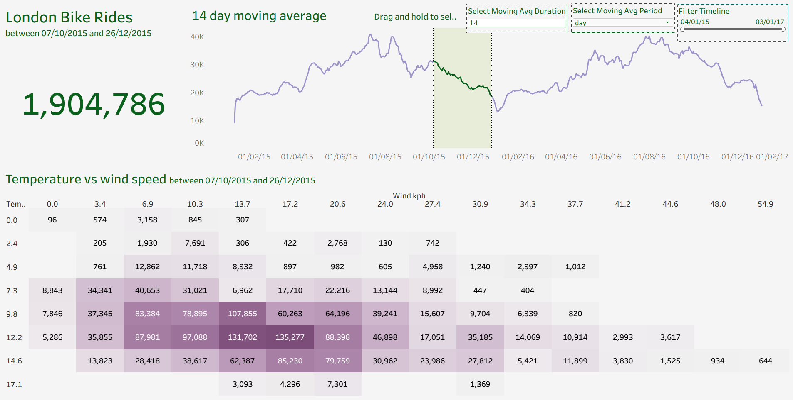

# London Bike Rides Analysis Dashboard (Tableau)

## Project Overview
This project presents an interactive Tableau dashboard analyzing bike-sharing usage patterns in London. The goal is to uncover meaningful insights into ride demand, temporal trends, and the influence of weather conditions on user behavior.

The dashboard transforms raw ride data into a clear and structured visual story, enabling data-driven decision-making for urban mobility and transportation planning.

---

## Objectives
- Analyze overall bike usage trends over time  
- Identify seasonal patterns and demand fluctuations  
- Examine the impact of weather conditions on ride frequency  
- Provide insights into peak usage periods  

---

## Key Insights

- Total rides exceeded 1.9 million within the selected timeframe  
- Strong seasonal patterns observed, with higher demand in warmer months  
- Noticeable decline in rides during colder periods  
- Clear relationship between temperature and ride frequency  
- Demand fluctuations stabilized using a 14-day moving average  
- Peak usage observed during specific high-activity periods  

---

## Dashboard Features

### Time-Series Analysis
- Daily ride trends visualized over time  
- 14-day moving average to highlight overall patterns and reduce noise  

### Weather Impact Analysis
- Correlation between temperature and ride demand  
- Analysis of weather variables such as wind speed and conditions  

### Trend Identification
- Detection of peak and low-demand periods  
- Seasonal behavior visualization  

### Interactive Design
- User-friendly layout for intuitive exploration  
- Filters for dynamic data analysis  

---

## Tools & Technologies

- Tableau – Data visualization and dashboard development  
- Excel / CSV – Data preprocessing and cleaning  

---

## Data Analysis Approach

- Cleaned and prepared raw ride data for analysis  
- Applied time-series techniques to identify trends and seasonality  
- Integrated weather data to analyze external impact on demand  
- Used moving averages to smooth fluctuations and improve insight clarity  

---

## Business Value

This dashboard provides valuable insights for:
- Urban planners to optimize bike availability  
- Transportation services to manage demand efficiently  
- Decision-makers to understand environmental impacts on usage  

---

## Project Structure

London-Bike-Rides-Dashboard  
├── Tableau Workbook (.twbx)  
├── Dataset  
├── Screenshots  
└── README.md  

---

## How to Use

1. Download the Tableau workbook file  
2. Open using Tableau Desktop or Tableau Public  
3. Interact with filters and visuals to explore trends  

---

## Dashboard Preview

---

## Skills Demonstrated

- Data Visualization  
- Time-Series Analysis  
- Data Storytelling  
- Analytical Thinking  
- Dashboard Design  
- Business Insight Generation  

---

## Conclusion

This project demonstrates the ability to analyze large datasets and convert them into actionable insights. It highlights how data visualization can be leveraged to understand real-world patterns and support strategic decision-making.

---

## Connect

LinkedIn: [[Your LinkedIn Link] ](https://www.linkedin.com/in/hidayat-ullah-5060743b6/) 
GitHub: [[Your GitHub Profile] ](https://github.com/hidayatollahian-313) 

---

## Support

If you found this project useful, consider giving it a star on GitHub.
